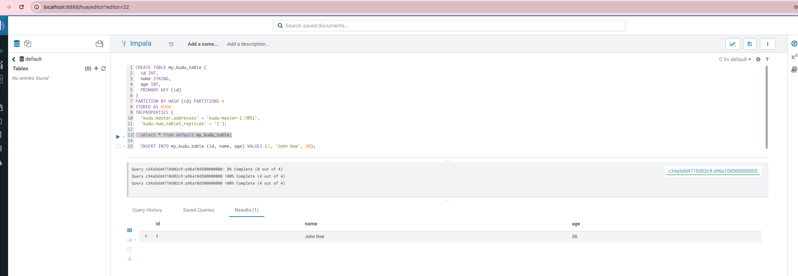

# Developing Applications With Apache Kudu

## 인프라 올리기

kudu 와 impala , hue 를 배포 합니다.

```
export KUDU_QUICKSTART_IP=$(ifconfig | grep "inet " | grep -Fv 127.0.0.1 |  awk '{print $2}' | tail -1)
docker-compose up
```

localhost:8888 접속 시 hue 에서 impala 를 조회 할 수 있습니다.


## pyspark 로 kudu 에 insert 해보기

스파크는 로컬에 설치해서 사용했습니다.

```
spark-submit --master local --packages org.apache.kudu:kudu-spark3_2.12:1.17.0 pyspark-kudu-write.py
```

## pyspark 로 kudu read 하기

```
spark-submit --master local --packages org.apache.kudu:kudu-spark3_2.12:1.17.0 pyspark-kudu-read.py
```
