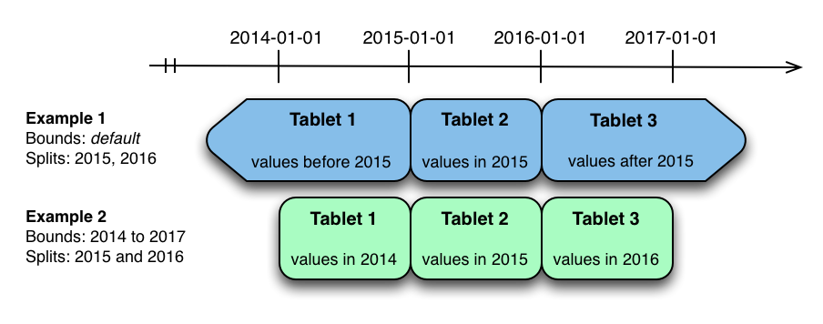
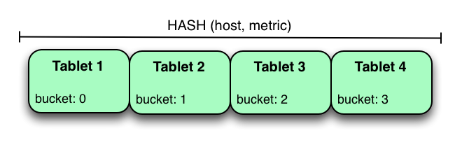
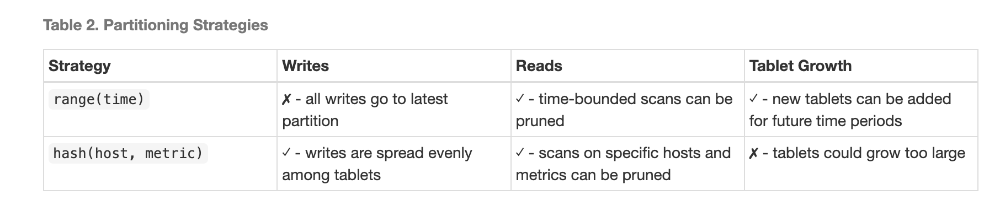
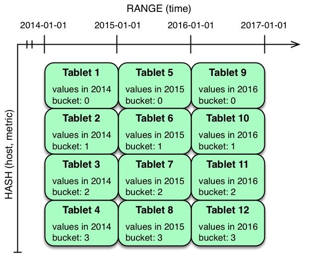
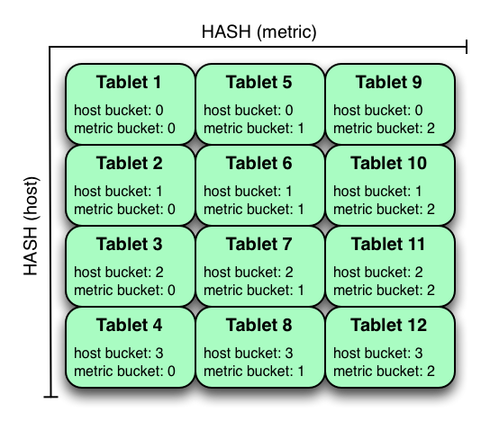
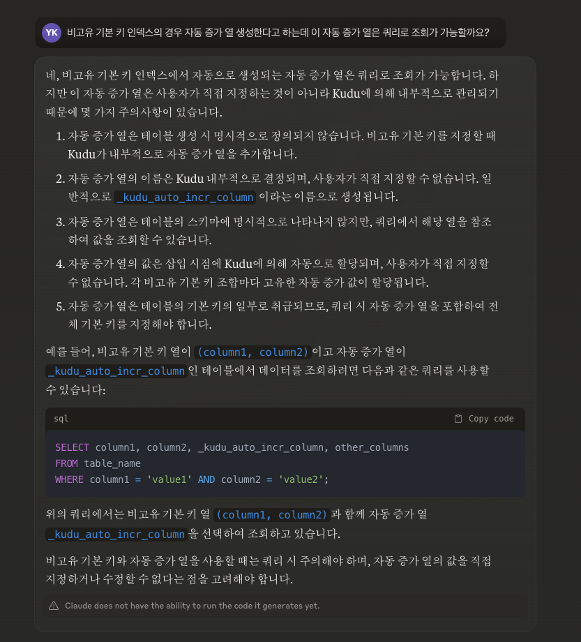

# Apache Kudu Schema Design - 원문 번역

출처 : https://kudu.apache.org/docs/schema_design.html

## 개요

Kudu 테이블은 기존의 RDBMS에서의 테이블과 유사한 구조화된 데이터 모델을 가지고 있습니다. 스키마 설계는 Kudu에서 최상의 성능과 운영 안정성을 달성하는 데 매우 중요합니다. 모든 워크로드는 고유하며, 모든 테이블에 가장 적합한 단일 스키마 설계는 없습니다. 이 문서에서는 기존 RDBMS 스키마에 사용되는 접근 방식과 다른 점에 특히 주의를 기울이면서 Kudu에 대한 효과적인 스키마 설계 철학을 간략히 설명합니다.

높은 수준에서 볼 때, Kudu 테이블을 생성할 때는 열 설계, 기본 키 설계 및 파티셔닝 설계의 세 가지 사항을 고려해야 합니다. 이 중에서 파티셔닝은 기존의 비분산 관계형 데이터베이스에 익숙한 사람들에게 새로운 개념입니다. 마지막 섹션에서는 기존 테이블의 스키마 변경 및 스키마 설계와 관련된 알려진 제한 사항에 대해 설명합니다.

## 완벽한 스키마

완벽한 스키마는 다음을 달성할 것입니다:

데이터가 읽기와 쓰기가 태블릿 서버에 고르게 분산되도록 분산됩니다. 이는 파티셔닝에 의해 영향을 받습니다.
태블릿은 일정하고 예측 가능한 속도로 증가하며 시간이 지나도 태블릿 간 부하가 일정하게 유지됩니다. 이는 파티셔닝에 의해 가장 큰 영향을 받습니다.
스캔은 쿼리를 충족하는 데 필요한 최소한의 데이터를 읽습니다. 이는 주로 기본 키 설계에 의해 영향을 받지만, 파티션 프루닝을 통해 파티셔닝도 역할을 합니다.
완벽한 스키마는 데이터의 특성, 데이터로 수행해야 할 작업 및 클러스터의 토폴로지에 따라 달라집니다. 스키마 설계는 Kudu 클러스터의 성능을 최대화하기 위해 사용자가 제어할 수 있는 가장 중요한 것입니다.

## 열 설계

Kudu 테이블은 하나 이상의 열로 구성되며, 각 열은 정의된 유형을 가집니다. 기본 키의 일부가 아닌 열은 null이 될 수 있습니다. 지원되는 열 유형에는 다음이 포함됩니다:

boolean
8비트 부호 있는 정수
16비트 부호 있는 정수
32비트 부호 있는 정수
64비트 부호 있는 정수
date (Unix 시대 이후의 32비트 일 수)
unixtime_micros (Unix 시대 이후의 64비트 마이크로초)
단정밀도 (32비트) IEEE-754 부동 소수점 수
배정밀도 (64비트) IEEE-754 부동 소수점 수
decimal (자세한 내용은 Decimal Type 참조)
varchar (자세한 내용은 Varchar Type 참조)
UTF-8 인코딩된 문자열 (압축되지 않은 상태로 최대 64KB)
binary (압축되지 않은 상태로 최대 64KB)
Kudu는 강력한 타입의 열과 컬럼형 온디스크 저장 형식을 활용하여 효율적인 인코딩과 직렬화를 제공합니다. 이러한 기능을 최대한 활용하려면 열을 문자열 또는 바이너리 열을 사용하여 '스키마리스' 테이블을 시뮬레이션하는 대신 적절한 유형으로 지정해야 합니다. 인코딩 외에도 Kudu는 열 단위로 압축을 지정할 수 있습니다.

#### 버전 또는 타임스탬프 열 없음

Kudu는 행의 변경 사항을 추적하기 위해 버전 또는 타임스탬프 열을 제공하지 않습니다. 버전 또는 타임스탬프 정보가 필요한 경우 스키마에 명시적인 버전 또는 타임스탬프 열을 포함해야 합니다.

### Decimal 타입

decimal 타입은 고정된 스케일과 정밀도를 가진 숫자형 데이터 타입으로, float과 double의 부정확한 표현과 반올림 동작으로 인해 이러한 타입이 실용적이지 않은 금융 및 기타 산술 계산에 적합합니다. decimal 타입은 int64보다 큰 정수와 기본 키에 소수 값이 있는 경우에도 유용합니다.

decimal 타입은 정밀도와 스케일 타입 속성을 가지는 매개변수화된 타입입니다.

정밀도는 소수점 위치에 관계없이 열에서 표현할 수 있는 총 자릿수를 나타냅니다. 이 값은 1에서 38 사이여야 하며 기본값이 없습니다. 예를 들어, 9999까지의 정수 값을 표현하거나 소수점 이하 두 자리까지 99.99를 표현하려면 정밀도 4가 필요합니다. 해당하는 음수 값도 정밀도를 변경하지 않고 표현할 수 있습니다. 예를 들어, -9999부터 9999까지의 범위는 여전히 정밀도 4만 필요합니다.

스케일은 소수 자릿수를 나타냅니다. 이 값은 0과 정밀도 사이여야 합니다. 스케일이 0이면 소수 부분이 없는 정수 값이 생성됩니다. 정밀도와 스케일이 같으면 모든 자릿수가 소수점 뒤에 옵니다. 예를 들어, 정밀도와 스케일이 3으로 동일한 decimal은 -0.999부터 0.999 사이의 값을 나타낼 수 있습니다.

### 성능 고려사항:

Kudu는 decimal 열에 지정된 정밀도에 따라 가능한 한 적은 바이트에 각 값을 저장합니다. 이러한 이유로 편의를 위해 가능한 가장 높은 정밀도를 사용하는 것은 권장되지 않습니다. 그렇게 하면 성능, 메모리 및 스토리지에 부정적인 영향을 미칠 수 있습니다.

인코딩 및 압축 전:

정밀도가 9 이하인 Decimal 값은 4바이트에 저장됩니다.
정밀도가 10에서 18 사이인 Decimal 값은 8바이트에 저장됩니다.
정밀도가 18보다 큰 Decimal 값은 16바이트에 저장됩니다.
decimal 열의 정밀도와 스케일은 테이블을 변경하여 변경할 수 없습니다.

### Varchar 타입

varchar 타입은 고정된 최대 문자 길이를 가진 UTF-8 인코딩 문자열(압축되지 않은 상태로 최대 64KB)입니다. 이 타입은 varchar 타입을 지원하는 레거시 시스템에서 마이그레이션하거나 통합할 때 특히 유용합니다. 최대 문자 길이가 필요하지 않은 경우에는 string 타입을 대신 사용해야 합니다.

varchar 타입은 길이 속성을 가지는 매개변수화된 타입입니다.

길이는 허용되는 최대 UTF-8 문자 수를 나타냅니다. 제한보다 많은 문자를 가진 값은 잘립니다. 이 값은 1에서 65535 사이여야 하며 기본값이 없습니다. 다른 일부 시스템은 문자 대신 바이트 단위로 길이 제한을 나타낼 수 있습니다. 즉, 멀티바이트 UTF-8 문자의 경우 Kudu가 더 긴 값을 표현할 수 있음을 의미합니다.

### 열 인코딩

Kudu 테이블의 각 열은 열의 유형에 따라 인코딩을 사용하여 생성할 수 있습니다.

Plain 인코딩

데이터는 자연스러운 형식으로 저장됩니다. 예를 들어, int32 값은 고정 크기 32비트 리틀 엔디언 정수로 저장됩니다.

Bitshuffle 인코딩

값 블록이 재정렬되어 모든 값의 가장 중요한 비트를 먼저 저장하고, 그 다음으로 모든 값의 두 번째로 중요한 비트를 저장하는 식으로 저장됩니다. 마지막으로 결과는 LZ4로 압축됩니다. Bitshuffle 인코딩은 반복되는 값이 많거나 기본 키로 정렬할 때 값이 작은 양만큼 변경되는 열에 적합합니다. bitshuffle 프로젝트는 성능과 사용 사례에 대한 좋은 개요를 제공합니다.

Run Length 인코딩

열에서 연속적으로 반복되는 값(runs)은 값과 개수만 저장하여 압축됩니다. Run length 인코딩은 기본 키로 정렬할 때 연속적으로 반복되는 값이 많은 열에 효과적입니다.

Dictionary 인코딩

고유한 값들의 사전이 구축되고, 각 열 값은 사전에서 해당 인덱스로 인코딩됩니다. Dictionary 인코딩은 낮은 카디널리티를 가진 열에 효과적입니다. 고유한 값의 수가 너무 많아서 주어진 행 집합의 열 값을 압축할 수 없는 경우, Kudu는 해당 행 집합에 대해 투명하게 plain 인코딩으로 폴백합니다. 이는 flush 중에 평가됩니다.

Prefix 인코딩

연속적인 열 값에서 공통 접두사가 압축됩니다. Prefix 인코딩은 공통 접두사를 공유하는 값이나 기본 키의 첫 번째 열에 효과적일 수 있습니다. 행은 태블릿 내에서 기본 키로 정렬되기 때문입니다.

### 열 압축

Kudu는 LZ4, Snappy 또는 zlib 압축 코덱을 사용하여 열 단위 압축을 허용합니다. 기본적으로 Bitshuffle 인코딩된 열은 LZ4 압축으로 본질적으로 압축됩니다. 그렇지 않으면 열은 압축되지 않은 상태로 저장됩니다. 원시 스캔 성능보다 저장 공간을 줄이는 것이 더 중요한 경우 압축 사용을 고려하세요.

모든 데이터 세트는 다르게 압축되지만, 일반적으로 LZ4는 가장 성능이 좋은 코덱이고 zlib는 가장 작은 데이터 크기로 압축됩니다. Bitshuffle 인코딩된 열은 자동으로 LZ4를 사용하여 압축되므로, 이 인코딩 위에 추가 압축을 적용하는 것은 권장되지 않습니다.

## 기본 키 설계

모든 Kudu 테이블은 하나 이상의 열로 구성된 기본 키를 선언해야 합니다. RDBMS 기본 키와 마찬가지로 Kudu 기본 키는 고유성 제약 조건을 적용합니다. 기존 행과 동일한 기본 키 값을 가진 행을 삽입하려고 하면 중복 키 오류가 발생합니다.

기본 키 열은 null일 수 없으며 boolean, float 또는 double 유형일 수 없습니다.

테이블 생성 중에 설정되면 기본 키의 열 집합을 변경할 수 없습니다.

RDBMS와 달리 Kudu는 명시적인 자동 증가 열 기능을 제공하지 않으므로 삽입 시 애플리케이션에서 항상 전체 기본 키를 제공해야 합니다.

고유성 제약 조건을 만족하지 않는 열도 비고유 기본 키로 지정하여 기본 키로 사용할 수 있습니다.

행 삭제 및 업데이트 작업에서도 변경할 행의 전체 기본 키를 지정해야 합니다. Kudu는 기본적으로 범위 삭제 또는 업데이트를 지원하지 않습니다.

행이 삽입된 후에는 열의 기본 키 값을 업데이트할 수 없습니다. 그러나 행을 삭제하고 업데이트된 값으로 다시 삽입할 수 있습니다.

### 기본 키 인덱스

많은 전통적인 관계형 데이터베이스와 마찬가지로 Kudu의 기본 키는 클러스터형 인덱스에 있습니다. 태블릿 내의 모든 행은 기본 키로 정렬됩니다.

Kudu 행을 스캔할 때 기본 키 열에 대해 동등 또는 범위 술어를 사용하여 행을 효율적으로 찾습니다.

기본 키 인덱싱 최적화는 개별 태블릿에 대한 스캔에 적용됩니다. 스캔이 술어를 사용하여 전체 태블릿을 건너뛰는 방법에 대한 자세한 내용은 파티션 프루닝 섹션을 참조하세요.

### 비고유 기본 키 인덱스

열을 비고유 기본 키로 지정하는 동안 Kudu는 내부적으로 자동 증가 열을 생성합니다. 지정된 열과 자동 증가 열이 실제 기본 키를 구성합니다.

자동 증가 열에 값을 할당하는 데 사용되는 자동 증가 카운터는 Kudu에 의해 관리되며, 카운터 값은 태블릿당 단조롭게 증가합니다.
비고유 기본 키 열은 null일 수 없으며 boolean, float 또는 double 유형일 수 없습니다.

테이블 생성 중에 설정되면 비고유 기본 키의 열 집합과 자동 증가 열을 변경할 수 없습니다.

삽입의 경우 자동 증가 열 값을 지정하지 않고 비고유 기본 키 열 값을 제공해야 합니다. 자동 증가 열은 서버 측에서 자동으로 채워집니다.

업데이트/삭제의 경우 전체 키 열 집합이 필요합니다. 업데이트/삭제 작업 전에 스캔을 수행하여 자동 증가 값을 얻어야 합니다.

비고유 기본 키가 있는 테이블에서는 Upsert 작업이 지원되지 않습니다.

행이 삽입된 후에는 열의 비고유 기본 키 값을 업데이트할 수 없습니다. 그러나 행을 삭제하고 업데이트된 값으로 다시 삽입할 수 있으며, 또한 삽입 중에 자동 증가 열에 대해 새 자동 증가 카운터 값이 할당됩니다.

현재 비고유 기본 키가 있는 테이블 복원은 지원되지 않습니다.

비고유 기본 키 사용 방법에 대한 자세한 내용은 examples 폴더를 확인하세요.

### 백필 삽입 시 고려사항

이 섹션에서는 기본 키가 타임스탬프이거나 기본 키의 첫 번째 열이 타임스탬프인 시계열 사용 사례에 대한 기본 키 설계 고려사항에 대해 설명합니다.

Kudu 테이블에 행이 삽입될 때마다 Kudu는 기본 키 인덱스 스토리지에서 기본 키를 조회하여 해당 기본 키가 이미 테이블에 있는지 확인합니다. 기본 키가 테이블에 존재하면 "중복 키" 오류가 반환됩니다. 데이터 소스에서 도착하는 대로 현재 시간에 데이터가 삽입되는 일반적인 경우에는 작은 범위의 기본 키만 "hot"입니다. 따라서 이러한 각 "존재 확인" 작업은 매우 빠릅니다. 메모리에 캐시된 기본 키 스토리지를 적중하고 디스크로 이동할 필요가 없습니다.

오프라인 데이터 소스에서 "백필링"이라고 하는 과거 데이터를 로드하는 경우 삽입되는 각 행은 메모리에 상주하지 않고 하나 이상의 HDD 디스크 탐색을 유발할 기본 키 인덱스의 콜드 영역을 적중할 가능성이 높습니다. 예를 들어, Kudu가 초당 수백만 개의 삽입을 지속하는 정상 수집 사례에서 "백필" 사용 사례는 초당 수천 개의 삽입만 지속할 수 있습니다.

백필링 중 성능 문제를 완화하려면 다음 옵션을 고려하세요:

기본 키를 더 압축 가능하게 만듭니다.

예를 들어, 기본 키의 첫 번째 열이 32바이트의 임의 ID인 경우 10억 개의 기본 키를 캐싱하려면 최소 32GB의 RAM이 캐시에 있어야 합니다. 며칠 전의 백필 기본 키를 캐싱하는 경우 32GB 메모리의 여러 배가 필요합니다. 기본 키를 더 압축 가능하게 변경하면 기본 키가 캐시에 맞을 가능성이 높아지고 임의 디스크 I/O의 양이 줄어듭니다.

스토리지에 SSD를 사용하면 임의 탐색이 회전 디스크보다 몇 배 빨라집니다.

백필 쓰기가 연속된 기본 키 범위를 적중하도록 기본 키 구조를 변경합니다.

## 파티셔닝

확장성을 제공하기 위해 Kudu 테이블은 태블릿이라는 단위로 분할되어 여러 태블릿 서버에 분산됩니다. 행은 항상 단일 태블릿에 속합니다. 행을 태블릿에 할당하는 방법은 테이블 생성 시 설정되는 테이블의 파티셔닝에 의해 결정됩니다.

파티셔닝 전략을 선택하려면 데이터 모델과 테이블의 예상 워크로드를 이해해야 합니다. 쓰기 작업이 많은 워크로드의 경우 단일 태블릿에 과부하가 걸리지 않도록 쓰기가 태블릿 전체에 분산되도록 파티셔닝을 설계하는 것이 중요합니다. 원격 서버 접속 오버헤드가 지배적인 많은 짧은 스캔이 포함된 워크로드의 경우, 스캔에 필요한 모든 데이터가 동일한 태블릿에 있으면 성능을 향상시킬 수 있습니다. 이러한 근본적인 트레이드오프를 이해하는 것은 효과적인 파티션 스키마를 설계하는 데 중요합니다.

### 기본 파티셔닝 없음

Kudu는 테이블 생성 시 기본 파티셔닝 전략을 제공하지 않습니다. 읽기 및 쓰기 워크로드가 많을 것으로 예상되는 새 테이블에는 최소한 태블릿 서버만큼의 태블릿이 있는 것이 좋습니다.

Kudu는 범위 파티셔닝과 해시 파티셔닝의 두 가지 유형의 파티셔닝을 제공합니다. 테이블은 범위 및 해시 파티셔닝을 결합하거나 해시 파티셔닝의 여러 인스턴스를 결합한 다중 수준 파티셔닝을 가질 수도 있습니다.

### 범위 파티셔닝

범위 파티셔닝은 완전히 정렬된 범위 파티션 키를 사용하여 행을 분산시킵니다. 각 파티션에는 범위 파티션 키스페이스의 연속 세그먼트가 할당됩니다. 키는 기본 키 열의 하위 집합으로 구성되어야 합니다. 범위 파티션 열이 기본 키 열과 일치하면 행의 범위 파티션 키는 기본 키와 같습니다. 해시 파티셔닝이 없는 범위 파티셔닝된 테이블에서 각 범위 파티션은 정확히 하나의 태블릿에 해당합니다.

초기 범위 파티션 집합은 테이블 생성 중에 파티션 경계 및 분할 행 집합으로 지정됩니다. 각 경계에 대해 테이블에 범위 파티션이 생성됩니다. 각 분할은 범위 파티션을 둘로 나눕니다. 파티션 경계가 지정되지 않으면 테이블은 전체 키 공간을 포괄하는 단일 파티션(아래 및 위로 무제한)으로 기본 설정됩니다. 범위 파티션은 항상 겹치지 않아야 하며, 분할 행은 범위 파티션 내에 있어야 합니다.

범위 파티셔닝에 대한 추가 설명은 범위 파티셔닝 예제를 참조하세요.

### 범위 파티션 관리

Kudu는 런타임에 다른 파티션의 가용성에 영향을 주지 않고 테이블에서 범위 파티션을 동적으로 추가 및 제거할 수 있습니다. 파티션을 제거하면 파티션에 속한 태블릿과 그 안에 포함된 데이터가 삭제됩니다. 삭제된 파티션에 대한 후속 삽입은 실패합니다. 새 파티션을 추가할 수 있지만 기존 범위 파티션과 겹치지 않아야 합니다. Kudu는 단일 트랜잭션 alter table 작업에서 원하는 수의 범위 파티션을 삭제하고 추가할 수 있습니다.

범위 파티션을 동적으로 추가 및 삭제하는 것은 특히 시계열 사용 사례에 유용합니다. 시간이 지남에 따라 향후 시간 범위를 포괄하기 위해 범위 파티션을 추가할 수 있습니다. 예를 들어, 이벤트 로그를 저장하는 테이블은 각 달의 시작 직전에 한 달 단위 파티션을 추가하여 다가오는 이벤트를 보유할 수 있습니다. 필요에 따라 기록 데이터를 효율적으로 제거하기 위해 이전 범위 파티션을 삭제할 수 있습니다.

### 해시 파티셔닝

해시 파티셔닝은 해시 값을 사용하여 여러 버킷 중 하나에 행을 분산시킵니다. 단일 수준 해시 파티셔닝된 테이블에서 각 버킷은 정확히 하나의 태블릿에 해당합니다. 버킷 수는 테이블 생성 중에 설정됩니다. 일반적으로 기본 키 열은 해시할 열로 사용되지만, 범위 파티셔닝과 마찬가지로 기본 키 열의 하위 집합을 사용할 수 있습니다.

해시 파티셔닝은 테이블에 대한 정렬된 액세스가 필요하지 않을 때 효과적인 전략입니다. 해시 파티셔닝은 쓰기를 태블릿 간에 무작위로 분산시키는 데 효과적이므로 핫스팟 및 태블릿 크기 불균형을 완화하는 데 도움이 됩니다.

해시 파티셔닝에 대한 추가 설명은 해시 파티셔닝 예제를 참조하세요.

### 다중 수준 파티셔닝

Kudu는 단일 테이블에 여러 수준의 파티셔닝을 결합할 수 있습니다. 0개 이상의 해시 파티션 수준을 선택적 범위 파티션 수준과 결합할 수 있습니다. 개별 파티션 유형의 제약 조건 외에 다중 수준 파티셔닝에 대한 유일한 추가 제약 조건은 여러 수준의 해시 파티션이 동일한 열을 해시해서는 안 된다는 것입니다.

올바르게 사용할 경우 다중 수준 파티셔닝은 각각의 단점을 줄이면서 개별 파티셔닝 유형의 이점을 유지할 수 있습니다. 다중 수준 파티셔닝된 테이블의 총 태블릿 수는 각 수준의 파티션 수의 곱입니다.

다중 수준 파티셔닝에 대한 추가 설명은 해시 및 범위 파티셔닝 예제 및 해시 및 해시 파티셔닝 예제를 참조하세요.

### 파티션 프루닝

Kudu 스캔은 스캔 조건에 의해 파티션 전체를 완전히 필터링할 수 있다고 판단되면 자동으로 전체 파티션 스캔을 건너뜁니다. 해시 파티션을 프루닝하려면 스캔에 해시된 모든 열에 대한 동등 조건이 포함되어야 합니다. 범위 파티션을 프루닝하려면 스캔에 범위 파티셔닝된 열에 대한 동등 또는 범위 조건이 포함되어야 합니다. 다중 수준 파티셔닝된 테이블에 대한 스캔은 각 수준에서 독립적으로 파티션 프루닝을 활용할 수 있습니다.

#### 파티셔닝 예제

테이블에 대한 파티셔닝 전략을 설계할 때 관련된 요소와 트레이드오프를 설명하기 위해 몇 가지 다른 파티셔닝 시나리오를 살펴보겠습니다. 머신 메트릭 데이터를 저장하기 위한 다음 테이블 스키마를 고려해 보세요(명확성을 위해 SQL 구문과 날짜 형식의 타임스탬프 사용):

sql

```
Copy code
CREATE TABLE metrics (
    host STRING NOT NULL,
    metric STRING NOT NULL,
    time INT64 NOT NULL,
    value DOUBLE NOT NULL,
    PRIMARY KEY (host, metric, time)
);
```

### 범위 파티셔닝 예제

metrics 테이블을 파티셔닝하는 자연스러운 방법은 time 열에 대해 범위 파티셔닝하는 것입니다. 연도별로 파티션을 가지고 싶고 테이블에 2014년, 2015년, 2016년 데이터가 저장된다고 가정해 보겠습니다. 테이블을 파티셔닝할 수 있는 방법은 최소한 두 가지가 있습니다: 무제한 범위 파티션 또는 제한된 범위 파티션.



위의 이미지는 metrics 테이블을 time 열에 대해 범위 파티셔닝할 수 있는 두 가지 방법을 보여줍니다. 첫 번째 예제(파란색)에서는 기본 범위 파티션 경계가 사용되며, 2015-01-01과 2016-01-01에서 분할됩니다. 이로 인해 세 개의 태블릿이 생성됩니다: 첫 번째는 2015년 이전의 값을 포함하고, 두 번째는 2015년의 값을 포함하며, 세 번째는 2016년 이후의 값을 포함합니다. 두 번째 예제(녹색)는 [(2014-01-01), (2017-01-01)]의 범위 파티션 경계를 사용하고, 2015-01-01과 2016-01-01에서 분할됩니다. 두 번째 예제는 [(2014-01-01), (2015-01-01)], [(2015-01-01), (2016-01-01)], [(2016-01-01), (2017-01-01)]의 범위 파티션 경계와 분할 없이 동일하게 표현될 수 있습니다. 첫 번째 예제에는 무제한 하한 및 상한 범위 파티션이 있는 반면, 두 번째 예제에는 경계가 포함됩니다.

위의 각 범위 파티션 예제는 시간 제한 스캔이 스캔의 시간 범위 외부에 있는 파티션을 프루닝할 수 있도록 합니다. 이는 파티션이 많을 때 성능을 크게 향상시킬 수 있습니다. 쓰기 시 두 예제 모두 잠재적인 핫스팟 문제가 발생합니다. 메트릭은 항상 현재 시간에 쓰여지는 경향이 있기 때문에 대부분의 쓰기는 단일 범위 파티션으로 이동합니다.

두 번째 예제는 첫 번째 예제보다 유연합니다. 미래 연도에 대한 범위 파티션을 테이블에 추가할 수 있기 때문입니다. 첫 번째 예제에서는 2016-01-01 이후의 모든 쓰기가 마지막 파티션에 포함되므로 파티션이 결국 단일 태블릿 서버가 처리하기에 너무 커질 수 있습니다.

### 해시 파티셔닝 예제

metrics 테이블을 파티셔닝하는 또 다른 방법은 host 및 metric 열에 대해 해시 파티셔닝하는 것입니다.



위의 예제에서 metrics 테이블은 host 및 metric 열을 기준으로 4개의 버킷으로 해시 파티셔닝됩니다. 앞서 살펴본 범위 파티셔닝 예제와 달리 이 파티셔닝 전략은 테이블의 모든 태블릿에 쓰기를 고르게 분산시켜 전체 쓰기 처리량을 향상시킵니다. 특정 호스트 및 메트릭에 대한 스캔은 동등 조건을 지정하여 파티션 프루닝을 활용할 수 있으므로 스캔된 태블릿 수를 하나로 줄일 수 있습니다. 순수 해시 파티셔닝 전략에서 주의해야 할 한 가지 문제는 테이블에 더 많은 데이터가 삽입됨에 따라 태블릿이 무한정 커질 수 있다는 것입니다. 결국 태블릿은 개별 태블릿 서버가 보유하기에 너무 커질 것입니다.

이 예제에서는 태블릿에 번호를 매기지만 실제로 태블릿에는 UUID 식별자만 주어집니다. 해시 파티셔닝된 테이블의 태블릿 간에는 자연스러운 순서가 없습니다.

### 해시 및 범위 파티셔닝 예제

이전 예제에서는 metrics 테이블을 time 열에 대해 범위 파티셔닝하거나 host 및 metric 열에 대해 해시 파티셔닝하는 방법을 보여주었습니다. 이러한 전략에는 다음과 같은 장단점이 있습니다:



해시 파티셔닝은 쓰기 처리량을 최대화하는 데 유리한 반면, 범위 파티셔닝은 무제한 태블릿 증가 문제를 방지합니다. 두 전략 모두 파티션 프루닝을 활용하여 다양한 시나리오에서 스캔을 최적화할 수 있습니다. 다중 수준 파티셔닝을 사용하면 두 전략을 결합하여 각각의 단점을 최소화하면서 두 전략의 이점을 모두 얻을 수 있습니다.



위의 예제에서는 time 열에 대한 범위 파티셔닝과 host 및 metric 열에 대한 해시 파티셔닝이 결합되어 있습니다. 이 전략은 해시 수준과 범위 수준에 대한 두 가지 차원의 파티셔닝으로 생각할 수 있습니다. 현재 시간에 이 테이블에 대한 쓰기는 해시 버킷 수(이 경우 4개)까지 병렬화됩니다. 읽기는 시간 범위 및 특정 호스트와 메트릭 조건을 활용하여 파티션을 프루닝할 수 있습니다. 새로운 범위 파티션을 추가할 수 있으며, 이는 4개의 추가 태블릿을 생성하는 결과를 가져옵니다(마치 다이어그램에 새 열이 추가된 것처럼).

### 해시 및 해시 파티셔닝 예제

Kudu는 동일한 테이블에서 여러 수준의 해시 파티셔닝을 지원할 수 있습니다. 단, 각 수준이 공통된 해시 열을 가지고 있지 않아야 합니다.



위의 예제에서 테이블은 host를 기준으로 4개의 버킷으로 해시 파티셔닝되고, metric을 기준으로 3개의 버킷으로 해시 파티셔닝되어 총 12개의 태블릿이 생성됩니다. 이 전략을 사용할 때 쓰기는 모든 태블릿에 분산되는 경향이 있지만, 개별 호스트 또는 메트릭의 모든 값이 항상 단일 태블릿에 속하기 때문에 여러 개의 독립적인 열에 대해 해시 파티셔닝할 때보다 핫스팟이 발생하기 쉽습니다. 스캔은 host 및 metric 열에 대한 동등 조건을 별도로 활용하여 파티션을 프루닝할 수 있습니다.

여러 수준의 해시 파티셔닝은 범위 파티셔닝과 결합할 수도 있는데, 이는 논리적으로 또 다른 차원의 파티셔닝을 추가합니다.

## 스키마 변경

다음과 같은 방법으로 테이블의 스키마를 변경할 수 있습니다:

테이블 이름 변경
기본 키 열 이름 변경
기본 키가 아닌 열의 이름 변경, 추가 또는 삭제
범위 파티션 추가 및 삭제
여러 변경 단계를 단일 트랜잭션 작업으로 결합할 수 있습니다.

## 알려진 제한 사항

Kudu에는 현재 스키마 설계에 영향을 줄 수 있는 몇 가지 알려진 제한 사항이 있습니다.

열 수

기본적으로 Kudu는 300개 이상의 열이 있는 테이블 생성을 허용하지 않습니다. 최상의 성능을 위해 열 수가 적은 스키마 설계를 권장합니다.

셀 크기

인코딩 또는 압축 전에 개별 셀은 64KB를 초과할 수 없습니다. 복합 키를 구성하는 셀은 Kudu에 의해 수행되는 내부 복합 키 인코딩 후 총 16KB로 제한됩니다. 이러한 제한 사항을 준수하지 않는 행을 삽입하면 클라이언트에 오류가 반환됩니다.

행 크기

개별 셀은 최대 64KB까지 가능하고 Kudu는 최대 300개의 열을 지원하지만 단일 행이 몇 백 KB를 초과하지 않는 것이 좋습니다.

유효한 식별자

테이블 및 열 이름과 같은 식별자는 유효한 UTF-8 시퀀스여야 하며 256바이트를 초과할 수 없습니다.

불변 기본 키

Kudu는 행의 기본 키 열을 업데이트할 수 없습니다.

변경 불가능한 기본 키

Kudu는 테이블 생성 후 기본 키 열을 변경할 수 없습니다.

변경 불가능한 파티셔닝

Kudu는 범위 파티션 추가 또는 삭제를 제외하고 생성 후 테이블이 파티셔닝되는 방식을 변경할 수 없습니다.

변경 불가능한 열 유형

Kudu는 열의 유형 변경을 허용하지 않습니다.

파티션 분할

테이블 생성 후에는 파티션을 분할하거나 병합할 수 없습니다.

삭제된 행 디스크 공간이 회수되지 않음

삭제된 행이 차지하는 디스크 공간은 압축을 통해서만 회수할 수 있으며, 삭제 기간이 "태블릿 기록 최대 기간"(--tablet_history_max_age_sec 플래그로 제어)을 초과하는 경우에만 가능합니다. 또한 Kudu는 현재 읽기/쓰기 성능을 향상시키기 위해서만 압축을 예약합니다. 태블릿은 순수하게 디스크 공간을 회수하기 위해 압축되지 않습니다. 따라서 많은 행이 폐기될 것으로 예상되는 경우 범위 파티셔닝을 사용해야 합니다. 범위 파티셔닝을 사용하면 개별 파티션을 삭제하여 데이터를 폐기하고 디스크 공간을 회수할 수 있습니다. 자세한 내용은 KUDU-1625를 참조하세요.

# Apache Kudu Schema Design - 이해한 내용 요약

## 개요

- 스키마 설계는 kudu 테이블의 성능 , 운영 안정성을 확보하는데 매우 중요한 역활을 가집니다.
- 문서에서는 열 설계 , 기본키 설계 , 파티셔닝 설계와 스미카 변경 , 설계에 대한 제한 사항을 설명할 예정이다.
- 파티셔닝은 RDBMS (MYSQL) 에도 존재하는 기능인데 왜 새롭다고 이야기 하는 걸까?

## 완벽한 스키마

- 좋은 스키마 구성은 데이터가 고르게 분산되도록 설계되어야 합니다. 최대한 데이터가 하나에 파티션에 편중되는 data skew 같은 현상을 방지해야 좋은 성능을 낼 수 있고 이를 위해 파티셔닝 디자인이 중요하다. 라는 이야기를 하고 있는 것 같습니다. 조회 할 때 스캔량을 최소화 하는 것이 유리하니 처음부터 데이터가 고루 분배될 수 있도록 파티셔닝을 설계하는 게 중요하겠다는 생각을 다시 하게 되었습니다.
- 현실과 이상은 다를 수 있다.. 물론 데이터가 몰리는 data skew 를 해소하고 스캔량을 최소화 할 수 있다면 정말 좋겠지만 현실의 데이터는 데이터 자체가 그렇지 못할 가능성이 있는데.. 이를 설계적으로 해결할 수 있을까?

## 열 설계

- 열에서 사용할 수 있는 타입 및 특성을 설명 합니다.
- 기본키에 포함된 열은 NULL 을 허용하지 않습니다.
- 열단위로 인코딩 및 압축을 지정할 수 있습니다.
- 메타데이터 상에서 타임스탬프 혹은 버전을 따로 관리하지 않는 다고 이야기 하는 것 같습니다. 이를 관리하려면 스키마 자체에 이를 기록하는 열을 만들어야 한다고.. 이러한 정보를 자동으로 메타 데이터에서 관리해주는 데이터베이스가 있나.. 싶습니다. (MYSQL 도 CREATED_AT 같은 컬럼을 별도로 생성해서 사용하기 때문에 물론 binlog 상에서 변경된 타임스탬프 정보를 조회할 수는 있겠지만..)
- decimal 타입의 경우 자리수에 따라 다른 바이트를 사용하기 때문에 (9자리수 이하 4byte , 10-18 자리는 8byte , 18 보다 크다면 16 byte ) 최대한 작은 자리수를 지정하는 편이 좋다고 합니다. 수정이 불가하기 때문에 신중할 필요가 있습니다!
- varchar 의 경우 65535 를 초과하는 문자열을 저장 할 수 없기 때문에 글자수가 65535 를 초과하는 경우에는 string 타입을 사용해야 한다고 합니다.
- 열 인코딩을 잘 활용하면 데이터 압축률을 높이고 쿼리 속도를 향상 시킬 수 있다고 합니다. 지원되는 인코딩은 다음과 같습니다.
  1. Plain 인코딩: 데이터를 자연스러운 형식으로 저장합니다. 기본 인코딩이며, 특별한 압축이나 인코딩을 적용하지 않습니다.
  2. Bitshuffle 인코딩: 값 블록을 재정렬하여 비트 단위로 압축합니다. 반복되는 값이 많거나 값 변화가 작은 열에 효과적입니다.
  3. Run Length 인코딩: 연속적으로 반복되는 값을 압축합니다. 중복된 값이 많은 열에 효과적입니다.
  4. Dictionary 인코딩: 고유한 값들의 사전을 구축하고 각 값을 사전의 인덱스로 매핑합니다. 카디널리티가 낮은 열에 효과적입니다.
  5. Prefix 인코딩: 연속적인 값들의 공통 접두사를 압축합니다. 접두사를 공유하는 값들이 많은 열에 효과적입니다.
- 열 압축 지원 코덱은 lz4 , snappy , zlib 이며 lz4 가 조회 성능 상 가장 좋은 코덱이고 zlib 이 압축 성능 상 가장 좋다고 합니다. Bitshuffle 인코딩은 기본적으로 lz4 로 압축되기 때문에 또 다시 압축을 적용하는 것은 권장 되지 않는 다고 합니다.

## 기본 키 설계

- 기본 키에서 null 은 허용되지 않습니다.
- KUDU 기본키에서는 AUTO INCREMENT 를 활용할 수 없습니다. 데이터 INSERT 시 기본 키에 해당하는 열 값이 반드시 명시되어야 합니다.
- 기본 키는 기본적으로 고유성 제약 조건이 있으나 비고유 기본키로 지정할 수도 있다고 합니다. 비고유 기본키로 지정 시 upsert 는 활용이 어렵습니다.
- 업데이트 , 삭제 시에 기본키를 지정하는 방식으로만 수행이 가능하다고 합니다. 기본 키가 아닌 키에 대한 조건 삭제 및 범위 삭제가 어렵다고 하는 것 같습니다.
- 키로 지정된 레코드 열 값은 업데이트가 어렵습니다. 삭제 후 다시 INSERT 가 필요합니다.
- 기본키 기반으로 인덱스가 생성되고 파티셔닝 디자인에 따라 스캔하지 않아도 되는 파티션 스캔을 생략하는 파티션 프루닝을 활용할 수 있다고 합니다. 실제 데이터가 분산되는 단위인 TABLET 이 파티션 단위로 분산되기 때문에 기본키 설정과 파티션 설정이 함께 동반되어야 합니다.
- 비고유 기본 키 인덱스는 지정된 열과 내부적으로 auto increment 성격의 열을 생성하여 인덱스를 생성한다는 것 같습니다. 이는 kudu 내부 적으로 관리되고 카운터 값은 태블릿 단위로 계속 증가하는 형태라고 하는데 내부적으로 생성하는 auto increment 한 열을 쿼리로 조회 가능한지가 궁금 했습니다. claude 에게 물어봤더니 조회가 가능하다고는 하는데 왠지 거짓말 같습니다. 
- 백필 삽입 시 고려사항에서는 kudu insert 시 기본 키가 존재하는 지를 체크 하기 위해 키 값을 메모리에 캐시 하고 먼저 이 캐시에 키가 존재하지 않는다면 disk 에 저장된 tablet 에서 키가 존재하는 지 체크해야 하는데 ( UPSERT 를 할지말지 , 비고유 기본키의 경우 AUTO INCREMENT 값을 어떻게 줄지 판단하기 위함이 아닐까 ) 계속 새로운 키가 발생하는 경우 (타임스탬프등이 기본키 열에 포함되어 고유한 레코드가 계속 들어오는 경우) disk io 를 유발하는 insert 가 계속 발생하기 때문에 insert 속도가 느려질 수 있다는 점을 이야기 하고 있습니다. 이에 기본키를 더 압축 시켜 더 많이 캐시 할 수 있게 하는 방법과 SSD 같은 스토리지를 사용하여 디스크 IO 성능 자체를 올리는 방법 , RANGE PARTITION 을 사용하여 INSERT 시 스캔 하여야 하는 키 값 범위 자체를 줄이는 방법 등을 제시 하였습니다. (파티션 하나의 크기가 커지면 커질수록 많은 양의 스캔이 필요하기 때문에)

## 파티셔닝

- KUDU 테이블은 태블릿 (tablet) 이라는 단위로 분산되어 저장 되는데 이 태블릿은 파티셔닝 설정에 따라 어떻게 분산될 지 결정 됩니다. 만약 데이터가 하나에 태블릿에 몰리는 현상이 발생한다고 하면 insert 속도와 (기본키가 존재하는 지 찾을 떄 스캔량이 많아지기 때문) 조회 속도가 느려질 수 있기 때문에 태블릿 하나에 부하가 가지 않게 데이터가 골고루 태블릿 간에 분산될 수 있게 디자인 하는 것이 (data skew 해소) 중요하다고 설명 합니다.
- 그럼에도 불구하고 스캔량 자체가 작은 경우에는 네트워크 오버헤드를 줄이기 위해 적은 수의 태블릿을 유지하는 게 좋을 수도 있다고 이야기 했습니다.
- KUDU 테이블 생성 시 PARTITION 은 필수 설정값은 아니지만 읽기 및 쓰기가 많을 것이라고 예상된다면 최소 태블릿 서버 만큼의 태블릿 수는 가지는 게 좋다고 이야기 하였습니다.
- 파티셔닝의 종류로 range paritioning (범위 파티셔닝) 과 hash partitioning (해시 파티셔닝) 을 지원합니다.
- 범위 파티셔닝은 특정 열에 값을 기반으로 파티셔닝을 설정하는 방법이며 파티션 범위를 계속 해서 추가할 수 있지만 범위 파티셔닝만 사용하면 특정 파티션에 데이터가 몰리는 현상 (DATA SKEW)를 완화시키기 어려울 수 있습니다.
- 해시 파티셔닝은 해시값을 설정된 개수만큼의 파티션으로 분리하여 저장하는 방식으로 파티셔닝 하게 되며 해시 함수의 균등분포 특성에 의해 균등하게 파티션별로 비슷한 크기로 파티션을 구성하게 될 것이라고 합니다. 실제로 해시 함수를 활용하여 균등 분배를 하는 기술이 서버 (NGINX,CDN) 나 DB(DYNAMO DB) (출처: https://velog.io/@jihoson94/%EA%B7%A0%EB%93%B1%ED%95%9C-%EB%B6%84%EB%B0%B0%EB%A5%BC-%EC%9C%84%ED%95%9C-%EA%B8%B0%EC%88%A0-%EC%95%88%EC%A0%95-%ED%95%B4%EC%8B%9C) 에서 사용 중인 것 같은데 해시 함수에 대한 이해도가 개인적으로 좀 부족한지 구체적으로 어떻게 균등하게 데이터를 분배시키는 지 헷갈립니다. 일단은 데이터를 균등하게 분배시키기 때문에 DATA SKEW 를 방지 할 수 있다. 로 이해하였고 이 조차도 만약 해시 파티셔닝을 지정한 열값이 고유하지 않고 많이 반복되는 경우 DATA SKEW 가 발생할 수 있고 이것을 완전히 극복하기는 어렵지 않을까.. 싶습니다. 또 해시 파티셔닝만 사용하면 해시 파티셔닝의 경우 ALTER 가 어렵기 때문에 기존에 설정된 파티셔닝 개수를 증가 시킬 수 없어서 시간이 지날 수록 파티셔닝 사이즈가 커질 수 있다는 단점이 있습니다.
- 다중 수준 파티셔닝을 사용함으로써 범위 파티셔닝 과 해시 파티셔닝의 단점을 해소 시킬 수 있다고 합니다. 예를 들면 범위 파티셔닝의 경우 범위를 추가 할 수 있으나 파티션별로 데이터를 균등하게 배분하기 어려운 단점이 있는데 범위 파티셔닝과 해시 파티셔닝을 함께 사용하게 되면 날짜별 데이터를 태블릿 단위에서는 균등하게 배분할 수 있게 되어 태블릿 단위에서 비교적 데이터를 균등하게 가져갈 수 있게 되고 스캔량을 최적화 할 수 있게 된다고 설명 합니다.
- 그 외 해시 파티션을 2개 사용하는 방법도 소개하고 있으나 이것 또한 데이터가 계속 많아진다면 태블릿 하나의 크기가 계속 커질 수 있기 때문에 이슈가 있지 않을까 생각됩니다.
- 개요에서 파티셔닝은 기존 비분산 관계형 데이터베이스에 익숙한 사람들에게는 새로운 개념이라고 소개한 부분이 있는데 범위 파티셔닝의 경우 MYSQL 에서도 존재하지만 해시 파티셔닝의 경우 새로운 개념이 맞다는 것을 이해 하였습니다. 분산 데이터베이스에서는 하나의 파티션에 데이터가 쏠리는 현상을 막아야 전체적인 성능을 향상 시킬 수 있기 때문에 이러한 파티셔닝이 필요하다는 것을 이해했습니다.

## 스키마 변경

- 지원되는 스키마 변경은 다음과 같습니다.
  1. 테이블 이름 변경
  2. 기본 키 열 이름 변경
  3. 기본 키가 아닌 열의 이름 변경, 추가 또는 삭제
  4. 범위 파티션 추가 및 삭제
  5. 여러 변경 단계를 단일 트랜잭션 작업으로 결합할 수 있습니다.

## 알려진 제한 사항

    1. 열수는 300개를 초과 할 수 없습니다.
    2. 인코딩 또는 압축 전에 개별 셀은 64KB를 초과할 수 없습니다.
    3. 기본 키 (PRIMARY KEY) 는 값도 업데이트가 불가능하고 ALTER 도 불가능 합니다.
    4. 범위 파티셔닝 추가 외에 다른 파티셔닝 ALTER 를 허용하지 않습니다.
    5. 열의 타입변경을 허용하지 않습니다.
    6. 파티션 분할 및 병합을 위한 ALTER 가 허용되지 않습니다.
